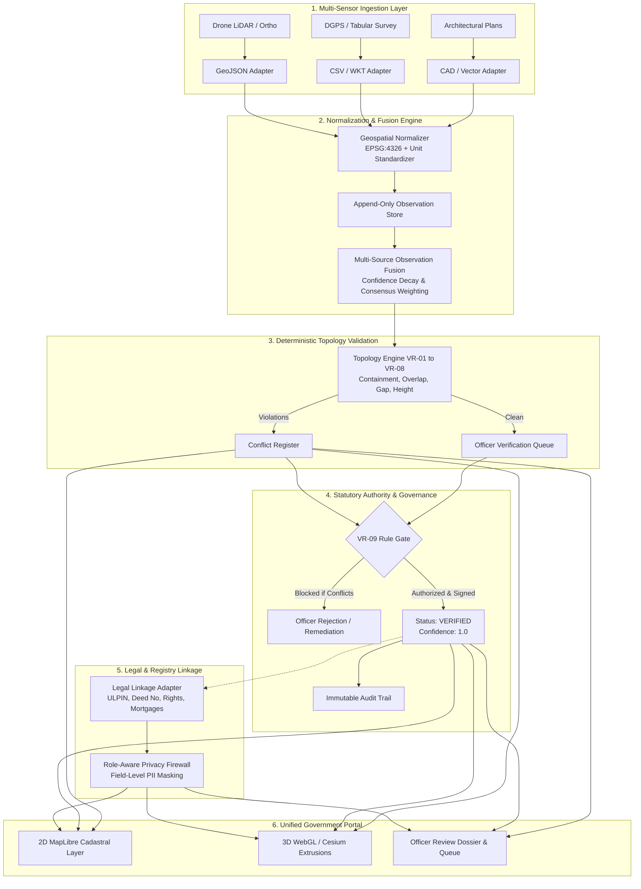

# 3D Cadastral Intelligence & Property Identification System
## Architecture & Technical Design Document (Max 2 Pages)

---

### 1. Executive Summary & Core Principles

The **3D Cadastral Intelligence & Property Identification System** is an enterprise-grade, evidence-backed platform designed for state revenue departments, municipal corporations, and national land record authorities. It provides an automated, mathematically rigorous, and auditable pipeline to transform multi-source geospatial data (drone LiDAR, photogrammetry, satellite imagery, DGPS survey, and architectural drawings) into a definitive, event-sourced 3D cadastral registry (**parcel → building → floor → unit**).

The architecture is governed by five non-negotiable axioms:
1. **AI Derives; Evidence Supports; Authority Verifies**: AI/GIS algorithms ingest, vectorize, and estimate attributes (e.g., building heights via nDSM, floor slices), but their outputs are strictly status-gated (`INFERRED`/`DERIVED`). Only statutory verifying officers can grant `VERIFIED` status.
2. **3D Property ID Identifies Space, Never an Owner**: Spatial identifiers follow the standard `{ULPIN}-{building_seq:03d}-F{floor_seq:02d}-U{unit_seq:03d}` (e.g., `INMH0234567-B001-F04-U402`). The spatial volume exists independently of legal tenure or individual identity.
3. **Strict Separation of Physical, Cadastral, and Legal Layers**: Spatial geometry (PostGIS), evidence provenance, and land registry records (`property_records`) remain decoupled. Owner identities are never synthesized or inferred.
4. **Append-Only Event Sourcing**: Edits are non-destructive. Every mutation appends an immutable `ChangeEvent`. Historical states can be replayed from genesis.
5. **Deterministic Topology Integrity**: Ingestion never drops data, but statutory verification is strictly blocked if spatial topology rules (VR-01 through VR-09) are violated.

---

### 2. High-Level Component Decomposition

---

### 3. Subsystem Architecture

#### A. Sensor Ingestion & Intermediate Canonical Normalization
Raw files are accepted via `/api/v1/ingestion/jobs`. Cryptographic SHA-256 digests ensure idempotency. The **Canonical Normalizer** reprojects foreign coordinates (e.g. EPSG:3857, UTM) into **EPSG:4326**, validates polygonal winding order, repairs micro-self-intersections via zero-distance buffering, and converts elevation metrics (feet/inches) into standard SI meters.

#### B. Observation Store & Weighted Consensus Fusion
Measurements are never overwritten. Each source observation is stored with capture timestamp, source system, and vendor confidence. When re-fused:
- **Recency Decay**: Exponential half-life discounting down-weights historical surveys.
- **Source Authority Weighting**: DGPS / Field surveys carry higher authority than remote satellite models.
- **Consensus Boosting**: Concurrent corroborating observations boost confidence towards asymptotic certainty ($1.0$). Discrepancies trigger a confidence penalty and register open conflicts.

#### C. Deterministic Topology Engine (Rules VR-01 through VR-09)
The engine executes geometric and topological validation before any record is signed off:
- **VR-01 / VR-05 (Boundary & Containment)**: Buildings and units must be completely within parcel boundaries with a strict tolerance threshold ($\le 0.05\text{m}$).
- **VR-02 (Unit Overlap)**: Horizontal polygon intersection on the same floor level cannot exceed $1.0\%$.
- **VR-03 (Anomaly / Gap)**: Enforces contiguous tessellation without unexplained interior void spaces.
- **VR-04 (Vertical Consistency)**: Floor elevation intervals $[z_{\min}, z_{\max}]$ must be monotonically ascending without vertical gaps or overlaps.
- **VR-06 / VR-07 (Near-Duplicate & Orphan Detection)**: Prevents redundant submissions and flags child units lacking parent floor/building relationships.
- **VR-08 / VR-09 (Conflict Generation & Verification Gate)**: Violations generate persistent `Conflict` records. Open unresolved conflicts hard-block transition to `VERIFIED`.

#### D. Status Lifecycle State Machine
$$\text{SYNTHETIC} \longrightarrow \text{INFERRED} \longrightarrow \text{DERIVED} \longrightarrow \text{PROVISIONAL} \overset{\text{Officer Sign-Off}}{\underset{\text{VR-09 Cleared}}{\longrightarrow}} \text{VERIFIED}$$

#### E. Legal Linkage & Cadastral Privacy Firewall
External land records link through `three_d_property_id` and statutory ULPIN. Rights types (`freehold`, `leasehold`, `strata_title`, `easement`) and encumbrances (bank mortgages, court attachments) are tracked. Opaque `owner_party_id` values are shielded behind field-level RBAC:
- **Public & Surveyors**: Owner identifiers are masked (`[REDACTED]`).
- **Verifying Officers & Admins**: Full unmasked identities are visible; every access and unmasked export generates an immutable forensic audit event.

---

### 4. Deployment Topology & Operational Non-Functionals

| Dimension | Specification | Architecture Guarantee |
| :--- | :--- | :--- |
| **Backend Runtime** | Python 3.11+ / FastAPI (Async ASGI) | Sub-50ms query latency; stateless horizontal scaling |
| **Spatial Database** | PostgreSQL 16 + PostGIS 3.4 | R-Tree GiST spatial indexing on 3D geometries |
| **Cache & Task Queue**| Redis 7.0+ | Distributed rate limiting and async ingestion queues |
| **Frontend UI** | React 18 + TypeScript + Vite | Hybrid 2D (MapLibre GL) & 3D (WebGL / CesiumJS) |
| **Security Perimeter**| OWASP Hardened Middleware | HSTS, CSP, Frame Options, JWT RBAC, Regex Rate Limiting |
| **Observability** | Prometheus Exporter + JSON Telemetry | Real-time tracking of conflict counts and verification SLAs |
| **Storage S3/MinIO** | S3-Compatible Object Store | WORM (Write Once Read Many) evidence archival |
