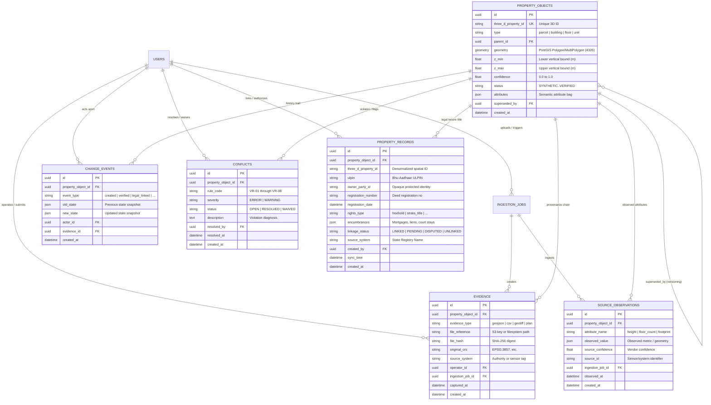

# 3D Cadastral Intelligence System — Data Model & Schema Specification

This document details the entity-relationship architecture, field dictionary, spatial hierarchy, and lifecycle state machines of the 3D Cadastral Intelligence platform.

---

## 1. Entity-Relationship Diagram



---

## 2. Spatial Hierarchy & 3D Identifier Specification

Every spatial object is identified by an immutable `three_d_property_id` conforming to the national cadastre pattern:

$$\mathbf{\{ULPIN\}-\{building\_seq:03d\}-F\{floor\_seq:02d\}-U\{unit\_seq:03d\}}$$

| Hierarchy Level | `type` | Sequence Formatting | Example Identifier | Description |
| :--- | :--- | :--- | :--- | :--- |
| **Parcel (Root)** | `parcel` | `B000-F00-U000` | `INMH0234567-B000-F00-U000` | Statutory cadastral land parcel rooted by ULPIN |
| **Building** | `building` | `B{seq:03d}-F00-U000` | `INMH0234567-B001-F00-U000` | Physical above/below ground building footprint |
| **Floor** | `floor` | `B{seq:03d}-F{seq:02d}-U000` | `INMH0234567-B001-F04-U000` | Horizontal slice at designated vertical interval $[z_{\min}, z_{\max}]$ |
| **Unit** | `unit` | `B{seq:03d}-F{seq:02d}-U{seq:03d}` | `INMH0234567-B001-F04-U402` | Individual apartment, office suite, or commercial space |

### Rules:
1. **Vertical Bounds**: Heights and elevations are represented in standard SI meters (`EPSG:4326` longitude/latitude + ellipsoidal/orthometric elevation $Z$).
2. **Monotonicity**: Floors within a building must maintain non-overlapping, monotonically increasing vertical bounds:
   $$z_{\min}(\text{Floor } k+1) \ge z_{\max}(\text{Floor } k) - \epsilon_{\text{tolerance}}$$
3. **Immutability**: A 3D Property ID identifies the space permanently. If a unit is subdivided, the original unit is superseded and new child unit sequences are assigned.

---

## 3. Status Lifecycle State Machine

The verification status follows an explicit, one-way progression:

$$\text{SYNTHETIC} \longrightarrow \text{INFERRED} \longrightarrow \text{DERIVED} \longrightarrow \text{PROVISIONAL} \overset{\text{Statutory Officer Sign-Off}}{\underset{\text{Rule VR-09 Enforced}}{\longrightarrow}} \text{VERIFIED}$$

| Status | Description | Confidence Baseline | Gating Criteria |
| :--- | :--- | :--- | :--- |
| `SYNTHETIC` | Seeded, synthetic, or preliminary placeholder boundary. | $0.0 - 0.4$ | Awaiting real sensor observations. |
| `INFERRED` | Preliminary shape detected via AI or remote sensing (e.g. raw footprint polygon). | $0.4 - 0.6$ | Unchecked by field survey. |
| `DERIVED` | Enriched via algorithmic pipeline (e.g., $n\text{DSM}$ building height or floor slicing). | $0.6 - 0.8$ | Algorithmic derivation attached. |
| `PROVISIONAL` | Normalized and ready for administrative review. Listed in the **Officer Verification Queue**. | $0.7 - 0.95$ | Ingestion and normalization complete. |
| `VERIFIED` | Statutory government sign-off. | **$1.0$** | **Rule VR-09**: No open conflicts; authorized officer signature. |

---

## 4. Separation of Concerns & Privacy Firewall

The schema maintains strict boundary isolation between physical space, legal tenure, and private personal data:

```text
┌─────────────────────────────────────────────────────────────┐
│ 1. SPATIAL CADASTRE (Public Domain)                         │
│    three_d_property_id, geometry, z_min, z_max, type        │
│    --> Identifies WHERE and WHAT the space is.              │
└──────────────────────────────┬──────────────────────────────┘
                               │ Linked by three_d_property_id
┌──────────────────────────────▼──────────────────────────────┐
│ 2. LEGAL TENURE (Authoritative Registry)                    │
│    ulpin, registration_number, rights_type, encumbrances    │
│    --> Identifies LEGAL DEED and STATUTORY RIGHTS.          │
└──────────────────────────────┬──────────────────────────────┘
                               │ Strict RBAC / Encryption
┌──────────────────────────────▼──────────────────────────────┐
│ 3. OWNER IDENTITY (Protected PII)                           │
│    owner_party_id (Opaque Reference)                        │
│    --> MASKED FOR PUBLIC & FIELD SURVEYORS                  │
│    --> ACCESSIBLE ONLY TO VERIFYING OFFICERS & ADMINS       │
└─────────────────────────────────────────────────────────────┘
```
