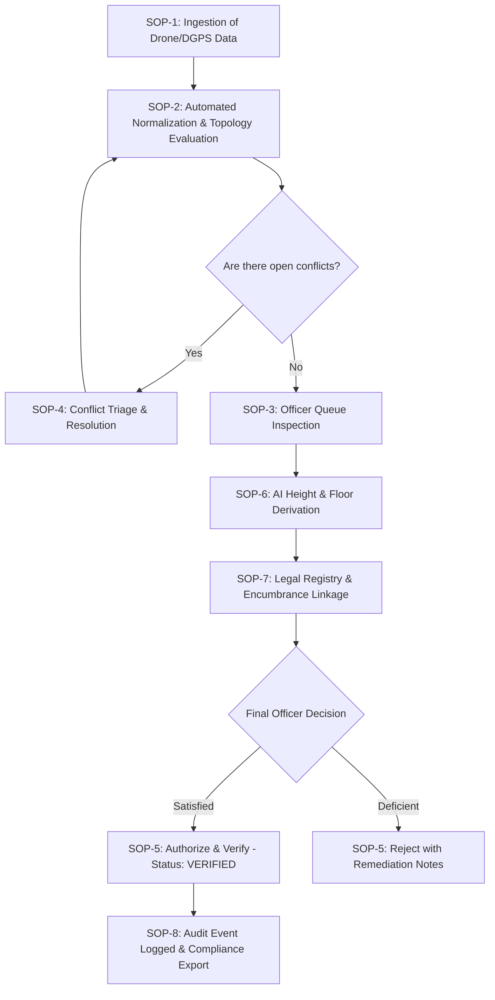

# 3D Cadastral Intelligence System — Government Operator Guide & SOPs

This document serves as the Standard Operating Procedure (SOP) manual for municipal officers, revenue department verifiers, GIS field surveyors, and system administrators operating the **3D Cadastral Intelligence & Property Identification Platform**.

---

## 1. Roles & Authority Matrix

| Role | Interface View | Primary Responsibilities | Statutory Authority |
| :--- | :--- | :--- | :--- |
| **Verifying Officer** | Full Officer Console | Queue review, conflict resolution, legal linkage, sign-off | **Can promote to `VERIFIED`**; views unmasked owner PII |
| **Field Surveyor** | Ingestion & Map | Drone survey uploads, tabular DGPS entry, observation checks | Submits raw/draft spatial data (`INFERRED`/`PROVISIONAL`) |
| **Administrator** | System Console | Topology rule configuration, batch re-validation, audit review | System maintenance, disaster recovery, user management |
| **Public Citizen** | Public Portal | Parcel search, 2D/3D map visualization, boundary checks | Read-only; owner PII strictly redacted |

---

## 2. Standard Operating Procedures (SOP)

---

### SOP-1: Ingestion & Field Data Triage

1. **Log in** with your assigned credentials or use the role switcher in the portal header to activate `📐 Field Surveyor` or `🛡️ Verifying Officer`.
2. Navigate to **Ingestion & Provenance** (`/ingestion`).
3. Under **Upload Cadastral Dataset**, select your file format:
   - **GeoJSON**: For aerial drone orthomosaics, parcel boundaries, or building footprint polygons (`EPSG:4326` or `EPSG:3857`).
   - **CSV**: For tabular DGPS surveys, floor height records, or interior unit layouts containing `wkt` geometry strings.
4. (Optional) Enter the **Source System Name** (e.g. `PUNE_DRONE_SURVEY_WARD120_2026`).
5. Click **Upload & Process Ingestion**.
6. Monitor the **Ingestion Job History** table. Verify:
   - **Status**: Changes from `PENDING` $\rightarrow$ `RUNNING` $\rightarrow$ `COMPLETED`.
   - **Records Ingested**: Matches the number of features in your survey file.
   - **SHA-256 Hash**: Cryptographic receipt recorded for legal provenance.

---

### SOP-2: 2D/3D Spatial Map Inspection

1. Navigate to **2D/3D Spatial Map** (`/map`).
2. **2D Cadastral View**:
   - Inspect boundary parcels rendered in crisp cadastral lines.
   - Use the mouse wheel to zoom into municipal ward boundaries.
3. **3D WebGL Extrusion Mode**:
   - Toggle the **3D Extrusions** button.
   - Hold `Right-Click` + Drag (or `Ctrl` + Left Click) to tilt and rotate the view in 3D perspective.
   - Review building heights extruded from the normalized digital elevation models.
4. Click any parcel or building on the map to open the **Property Dossier Drawer** on the right side of the screen.

---

### SOP-3: Officer Review Queue Management

1. Switch active role to **`🛡️ Verifying Officer`**.
2. Navigate to **Officer Verification Queue** (`/properties`).
3. Use the filter chips at the top:
   - **Ready for Sign-off (Clean)**: Provisional records that have cleared all automated topology checks with zero conflicts.
   - **Blocked by Conflicts**: Provisional records flagged with open topology or boundary violations.
4. Click on any record to open its review dossier.
5. In the dossier drawer, review:
   - **Spatial Hierarchy**: Verify parent parcel $\rightarrow$ building $\rightarrow$ floor $\rightarrow$ unit relationships.
   - **Provenance Chain**: Review the source files and SHA-256 digests under the **Evidence** tab.
   - **Raw Sensor Observations**: Compare conflicting measurements from multiple sensors (e.g., Drone LiDAR vs Architect CAD drawing).

---

### SOP-4: Topology Conflict Resolution

1. Navigate to **Topology Conflicts** (`/conflicts`).
2. Review the violation diagnostics:
   - **VR-01 / VR-05**: Building footprint boundary overhang outside parcel.
   - **VR-02**: Unit polygon overlap on the same floor level ($> 1\%$).
   - **VR-03**: Floor gap or unassigned void interior space.
   - **VR-04**: Vertical consistency elevation mismatch between floors.
   - **VR-07**: Orphan building or unit lacking parent spatial binding.
3. For each open conflict:
   - **Resolve**: If field re-survey has corrected the geometry, enter the resolution justification and click **Resolve**.
   - **Waive**: If the violation represents an allowable non-structural architectural feature (e.g., small decorative sunshade overhang $\le 15\text{cm}$), enter the statutory waiver rationale and click **Waive**.
4. Click **⚡ Run Topology Batch Validation** to recalculate the rules across the entire ward.

---

### SOP-5: Authoritative Verification & Rejection

> [!IMPORTANT]
> **Rule VR-09 Hard Gate**: The system will prohibit you from verifying any property that has open `ERROR` severity conflicts. You must resolve or waive all conflicts first.

1. Once all conflicts are cleared and the record status is `PROVISIONAL`:
2. Scroll to the **Verification Authority** panel in the property dossier drawer.
3. Enter official statutory remarks (e.g., *"Verified against Municipal Town Planning sanctioned drawing Ref #PMC/2026/8812"*).
4. Click **Sign & Authorize (Verify)**.
   - Status transitions to `VERIFIED`.
   - Confidence score updates to `1.0`.
   - An immutable `verified` audit event is written to the cryptographic change log.
5. **Rejection Procedure**:
   - If the spatial data is defective or fraudulent, click **Reject Submission**.
   - Enter mandatory rejection reasons and remediation instructions for the field surveyor.

---

### SOP-6: AI Height & Floor Estimation Execution

1. In the property dossier, locate the **🤖 AI / GIS Spatial Analysis** panel.
2. Enter the input surface elevation parameters:
   - **DSM Surface Elevation ($Z_{\text{top}}$)**: e.g., $588.0\text{ m}$
   - **DEM Terrain Elevation ($Z_{\text{base}}$)**: e.g., $560.0\text{ m}$
   - **Building Usage**: Select `Residential` ($3.0\text{m/floor}$) or `Commercial` ($3.5\text{m/floor}$).
3. Click **⚡ Execute AI Spatial Pipeline (Height + Floors)**.
4. **Observe the Result**:
   - Derived building height ($n\text{DSM} = 28.0\text{m}$) and estimated floor count ($8\text{ floors}$) are calculated.
   - **Status Gating**: The property record advances to `DERIVED` or `INFERRED`, but **never** `VERIFIED`. Statutory officer review is mandatory.

---

### SOP-7: Legal Land Registry Linkage

1. In the property dossier, open the **🏛️ Legal & Land Registry Linkage** panel.
2. Click **+ Link Land Registry Title**.
3. Complete the statutory title fields:
   - **ULPIN**: 14-digit Bhu-Aadhaar parcel identifier (e.g., `INMH0234567`).
   - **Deed Registration Number & Date**: Official registration reference from the Sub-Registrar Office (IGR).
   - **Rights Type**: Select `freehold`, `leasehold`, `strata_title`, or `easement`.
   - **Encumbrance / Bank Charges**: Record any registered mortgage (e.g., State Bank of India commercial loan charge).
4. Click **Save & Authorize Linkage**.

---

### SOP-8: Compliance Audits & PII-Redacted Bulk Export

1. Navigate to **Audit & Export** (`/audit`).
2. **Audit Review**: Filter change events by event type (`verified`, `legal_linked`, `pii_exported`) or actor ID.
3. **Cadastral Export**:
   - Select format: `JSON` or `CSV`.
   - **Redact PII (Default)**: Keeps owner identities masked for open-data publishing.
   - **Unmasked Export (Officers Only)**: Uncheck "Redact PII", enter a mandatory statutory purpose (e.g., *"Sub-Registrar boundary dispute inquiry Ward 120"*). Every unmasked export logs a forensic audit entry.
